# 🚀 HabitFlow

A modern Full Stack Habit Tracker application built with Next.js, TypeScript, Prisma, PostgreSQL and NextAuth.

HabitFlow helps users create habits, track daily progress, visualize consistency, and build better routines through a clean and responsive dashboard experience.

---

## ✨ Features

- 🔐 Authentication with NextAuth
- 🧠 Protected routes
- ✅ Create, edit and delete habits
- 📅 Daily habit completion tracking
- 🔥 Current and best streak system
- 📊 Dashboard analytics
- 📈 Progress charts with Recharts
- 📱 Responsive design
- 🎨 Modern SaaS UI
- ⚡ Full Stack architecture with Next.js App Router

---

## 🛠️ Tech Stack

### Frontend

- Next.js 16
- React
- TypeScript
- Tailwind CSS
- Recharts
- React Hot Toast

### Backend

- Next.js Route Handlers
- Prisma ORM
- PostgreSQL (Neon)
- NextAuth
- Zod
- bcryptjs

### Deployment

- Vercel
- Neon Database

---

## 🌐 Live Demo

👉 https://SEU-LINK-VERCEL.vercel.app

---

## 📸 Screenshots

### 🏠 Landing Page

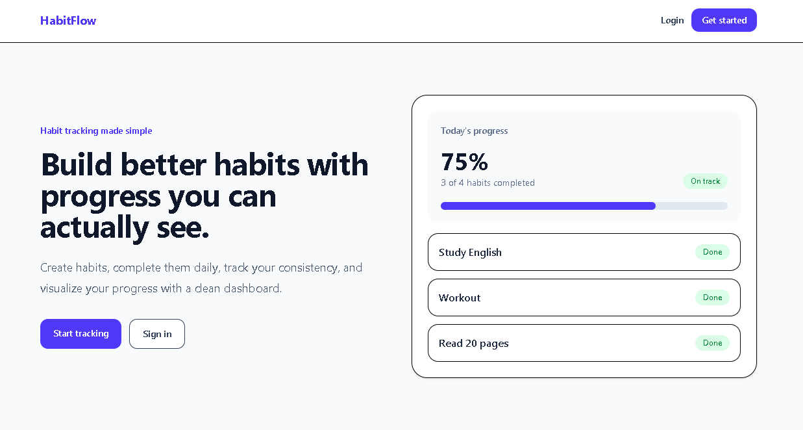

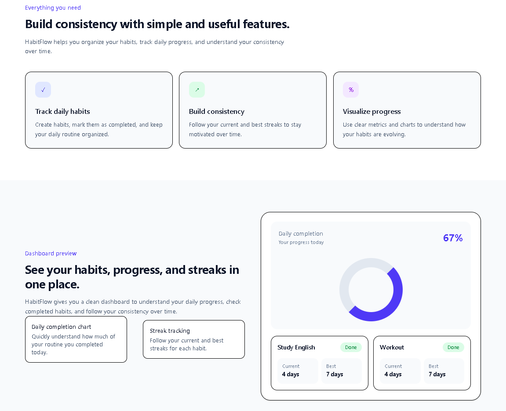

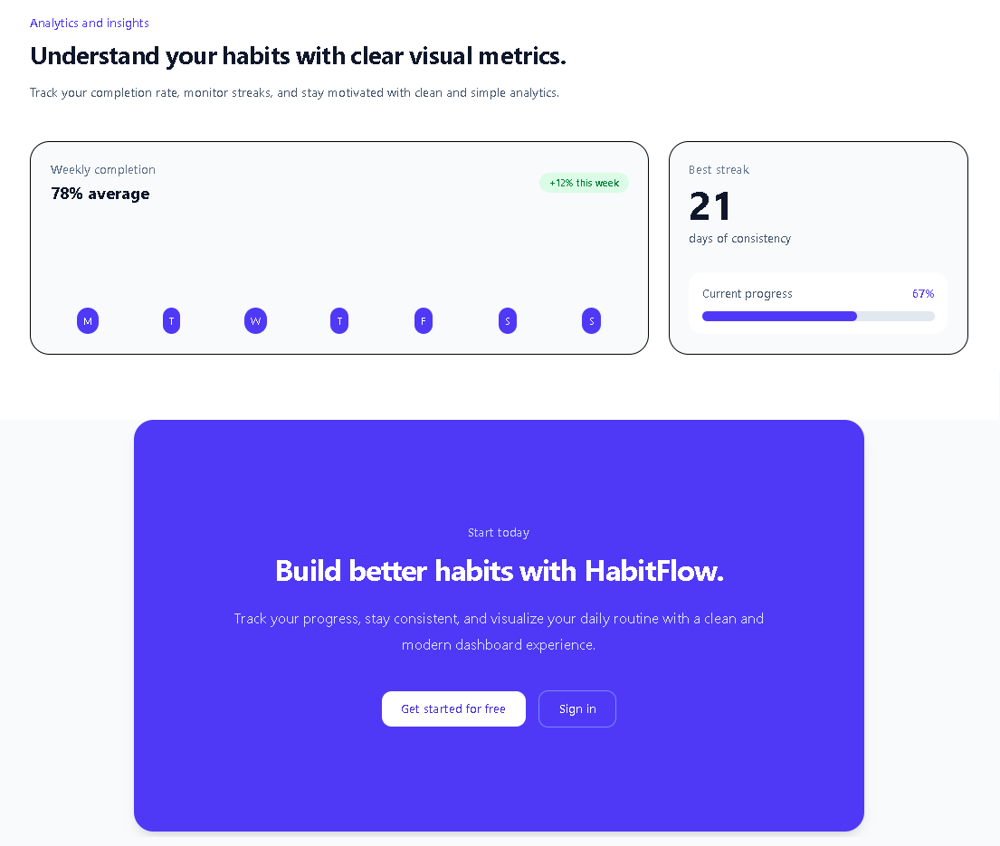

---

### 📊 Dashboard

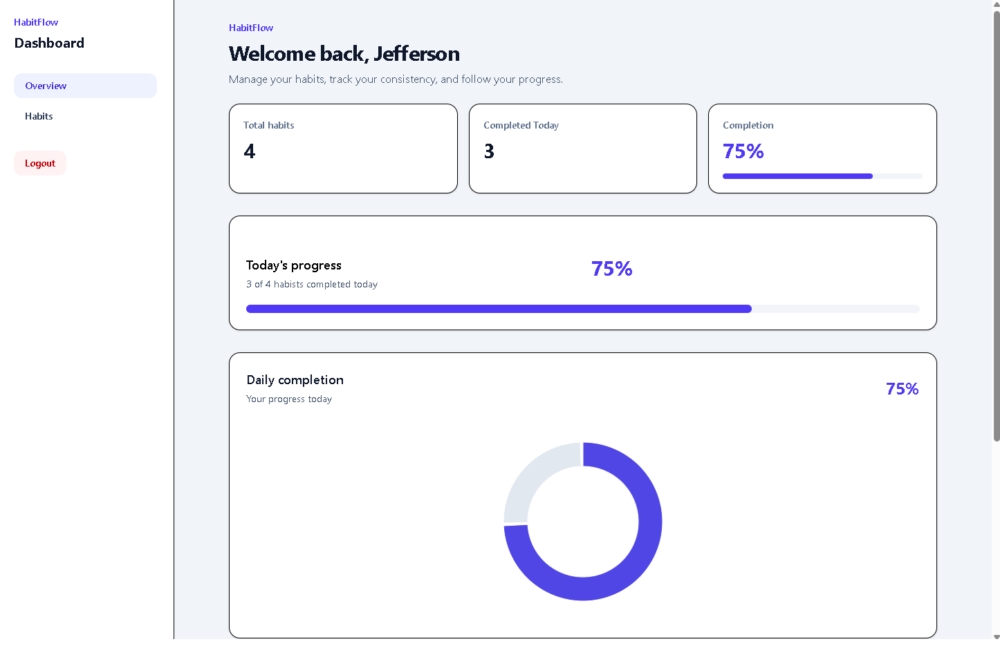

---

### ✅ Habits Page

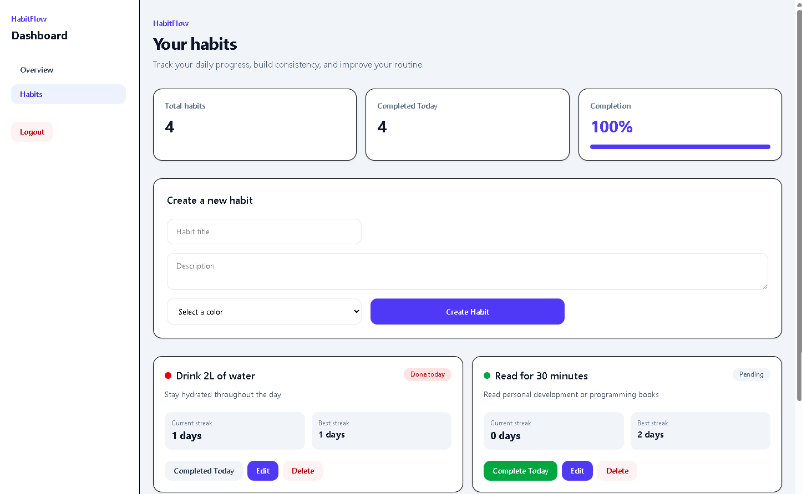

---

### 📱 Mobile Responsive

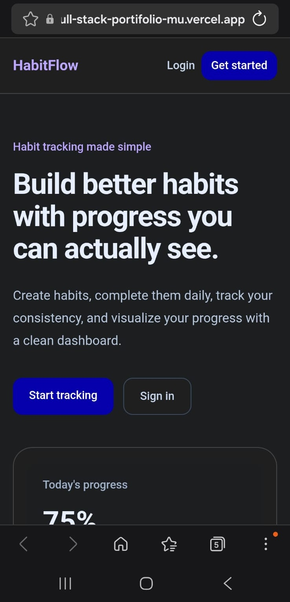

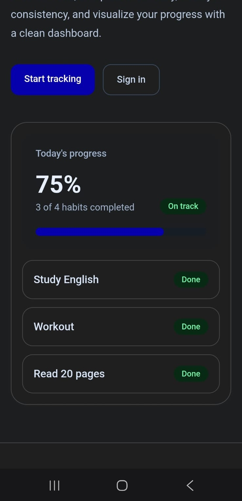

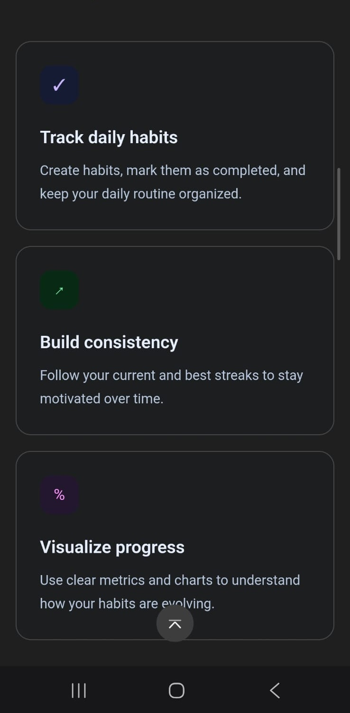

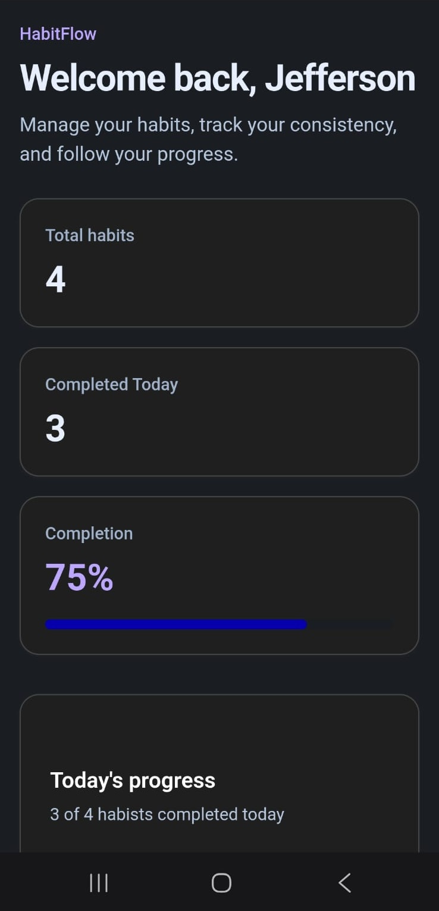

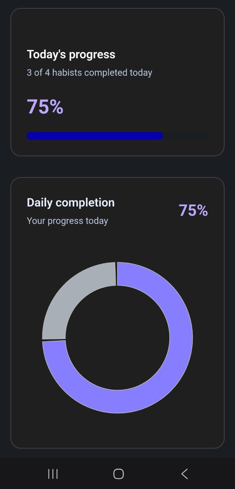

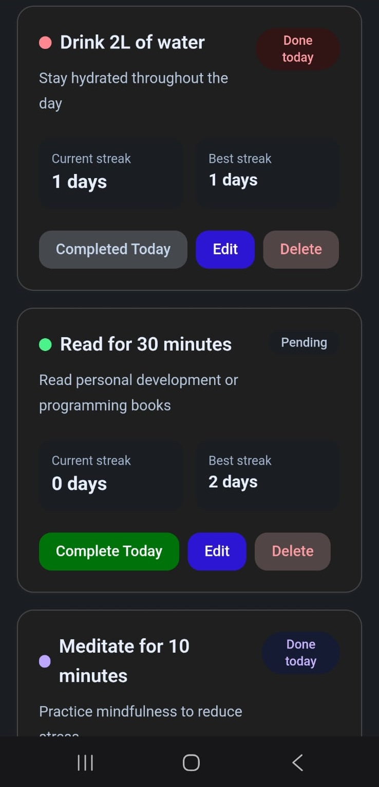

## 🧱 Architecture

HabitFlow was built using the Next.js App Router architecture, combining Server Components, Client Components and Route Handlers.

### Main flow

```txt
User
↓
Next.js App Router
↓
Authentication with NextAuth
↓
Protected Pages / API Routes
↓
Validation with Zod
↓
Prisma ORM
↓
PostgreSQL Database
```

### Main entities

```txt
User
 └── Habit
      └── HabitCompletion
```

### Core business rules

- Each user can only access their own habits.
- A habit can be completed once per day.
- Clicking a completed habit again removes the completion for that day.
- Streaks are calculated based on completion history.
- Dashboard metrics are derived from real user data.

## ⚙️ Installation

### 1. Clone the repository

```bash
git clone https://github.com/SEU-USUARIO/projeto-02-habit-flow.git
```

### 2. Access the project folder

```bash
cd projeto-02-habit-flow
```

### 3. Install dependencies

```bash
npm install
```

### 4. Configure environment variables

Create a `.env` file in the root of the project:

```env
DATABASE_URL="your_database_url"
NEXTAUTH_SECRET="your_secret"
NEXTAUTH_URL="http://localhost:3000"
```

### 5. Generate Prisma Client

```bash
npx prisma generate
```

### 6. Run database migrations

```bash
npx prisma migrate dev
```

### 7. Start the development server

```bash
npm run dev
```

The application will run on:

```txt
http://localhost:3000
```

## 📚 What I Learned

During the development of HabitFlow, I improved my knowledge in:

- Full Stack application architecture with Next.js App Router
- Authentication flows with NextAuth
- Protected routes and session validation
- CRUD operations with Prisma ORM
- PostgreSQL relational modeling
- Server Components vs Client Components
- API Route Handlers in Next.js
- Data validation with Zod
- Password hashing with bcryptjs
- Dashboard and analytics UI design
- Responsive SaaS-style interfaces
- State updates with router.refresh()
- Production deployment with Vercel and Neon

---

## 🚀 Future Improvements

- Weekly and monthly analytics
- Calendar heatmap visualization
- Habit categories
- User profile settings
- Dark mode
- Drag and drop habit organization
- Notifications and reminders
- Social login providers
- Better mobile interactions
- Advanced dashboard analytics

---

## 👨‍💻 Author

Developed by Jefferson Rizzetto.

- GitHub: https://github.com/SEU-USUARIO
- LinkedIn: https://linkedin.com/in/SEU-LINKEDIN
